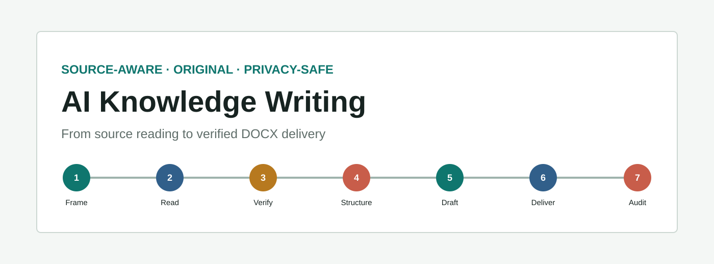

<p align="center">
  
</p>

# AI Knowledge Writing Skill

[](https://github.com/sushuqiong/ai-knowledge-writing-skill/releases)
[](https://github.com/sushuqiong/ai-knowledge-writing-skill/actions/workflows/validate.yml)
[](https://agentskills.io/)
[](SECURITY.md)
[](LICENSE)

**A platform-neutral Agent Skill for source reading, fact boundaries, original public writing, verified DOCX delivery, and privacy review.**

[中文说明](README.md) · [Live workbench](https://sushuqiong.github.io/ai-knowledge-writing-skill/en.html) · [v0.3.0](https://github.com/sushuqiong/ai-knowledge-writing-skill/releases/tag/v0.3.0)

## 30-second start

```powershell
npx skills add sushuqiong/ai-knowledge-writing-skill --list
npx skills add sushuqiong/ai-knowledge-writing-skill --skill ai-knowledge-writing-skill -g -y
```

```text
Use $ai-knowledge-writing-skill to turn [topic or source] into an original Chinese public explainer for [audience], verify changing claims, and deliver a privacy-safe DOCX within [length].
```

## The workflow

Public writing is more than text generation. Sources may be incomplete, current
claims may need verification, close paraphrasing may preserve the source too
closely, high-stakes topics need limits, and a saved Word file may still be
incomplete or expose metadata.

`Frame -> Read -> Verify -> Structure -> Draft -> Deliver -> Audit`

| Request | Primary recipe | Core acceptance |
| --- | --- | --- |
| concept, method, or workflow | `concept-explainer` | definition, value, basic process, outputs, limits |
| image, screenshot, or document | `source-to-article` | visible facts, inference, missing context, original structure |
| medical or high-stakes topic | `high-risk-health` | authoritative evidence, scope, uncertainty, educational boundary |
| product, tool, or price comparison | `product-comparison` | dated snapshot, equal dimensions, first-party sources, cost type |
| glossary or fixed list | `glossary-list` | exact count, preserved order, duplicates, one sentence per item |
| Word artifact | `docx-delivery` | count, structure, links, metadata, reopened file |

## The five workbench lanes remain

Public writing composes the existing `browser`, `visualize`, `sites`, `queue`,
and `precision` lanes. It is not a sixth lane.

## Optional DOCX tools

The deterministic local tools do not browse, upload, or call a model:

```powershell
python -m pip install -r requirements.txt
python scripts/render_docx.py --input templates/article.example.json --output dist/example.docx
python scripts/validate_article.py --input templates/article.example.json --docx dist/example.docx
```

Body length counts non-whitespace characters in section headings and body
paragraphs. It excludes title, subtitle, disclaimer, and sources. The renderer
embeds no images and clears author, last-modifier, and comments metadata.

## Verification and boundaries

```powershell
python scripts/validate_public_package.py
python -m unittest discover -s tests -v
```

The repository contains 24 privacy-safe behavior cases and 14 deterministic
tests. Validation covers routing, package structure, length, hyperlinks, DOCX
integrity, metadata, and privacy patterns. It does not prove domain claims or
replace professional review.

All public examples are synthetic or use placeholders. The project contains no
historical article, user attachment, private knowledge base, local path, personal
contact detail, credential, internal URL, telemetry, or backend. See the
[originality boundary](docs/originality.md) and [security policy](SECURITY.md).

## License

All repository content remains available under the [MIT License](LICENSE).
