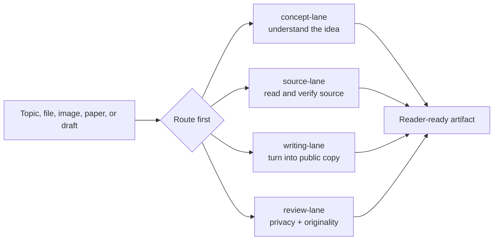

<p align="center">
  
</p>

<h1 align="center">AI Knowledge Writing Skill</h1>

<p align="center">
  <b>A route-first Codex skill for learning technical material and turning it into public explainers.</b>
</p>

<p align="center">
  
  
  
</p>

## Why This Exists

People often use AI in two separate ways: first to learn something, then to turn that knowledge into an article, note, script, or public explanation. The hard part is not only writing. The hard part is choosing the right route, checking what is true, avoiding copied wording, and removing private details before publishing.

`ai-knowledge-writing-skill` is a reusable route-first skill for that workflow. It helps Codex move from messy source material to a clear next artifact: a concept explanation, source summary, WeChat-style article, output template, or privacy review.

## Four-Lane Workbench

| Lane | Best for | Typical output |
|---|---|---|
| `concept-lane` | unfamiliar terms, tools, workflows, or beginner learning | plain-language concept map and short explainer |
| `source-lane` | documents, images, screenshots, diagrams, transcripts, papers | fact/inference split, key points, caveats |
| `writing-lane` | public articles, WeChat/公众号 drafts, learning notes | title, outline, polished copy, takeaway |
| `review-lane` | publishing checks, privacy review, originality checks | risk notes, redactions, uncertainty boundaries |



## Quick Start

Copy this repository folder into your Codex skills directory, or copy `SKILL.md`, `agents/`, `references/`, and `assets/` into a skill folder named:

```text
ai-knowledge-writing-skill
```

Then ask Codex:

```text
Use $ai-knowledge-writing-skill to explain [topic] for beginners and give me a public article outline.
```

```text
Use $ai-knowledge-writing-skill to interpret [source] and turn it into a concise WeChat-style explainer.
```

```text
Use $ai-knowledge-writing-skill to review this draft for unsupported claims, copied wording, and privacy risks.
```

## What Makes It Different

- It starts with routing, not immediate writing.
- It separates facts, inference, uncertainty, and public-facing wording.
- It treats learning, source interpretation, writing, and review as connected but distinct lanes.
- It includes privacy and originality checks before public output.
- It is generic enough for AI, computing, biomedical, research, tool-learning, and workflow-explanation tasks.

## Repository Contents

| Path | Purpose |
|---|---|
| `SKILL.md` | Main Codex skill instructions and trigger logic |
| `agents/openai.yaml` | Skill UI metadata |
| `references/routing.md` | Route selection and minimal questions |
| `references/source-reading.md` | Source interpretation and fact-boundary rules |
| `references/public-writing.md` | Public explainer and WeChat-style writing rules |
| `references/output-templates.md` | Reusable templates for learning, writing, and review |
| `references/privacy-originality.md` | Privacy, originality, and publishing safety rules |
| `assets/repo-cover.svg` | Original repository cover image |

## Privacy and Originality

This skill is designed for public-facing knowledge work. Do not publish local file paths, credentials, private URLs, account identifiers, unpublished data, private screenshots, or personal details. Use placeholders such as `[source]`, `[topic]`, `[document]`, `[dataset]`, or `[repository]` when examples are needed.

The workflow is inspired by route-first navigation. All wording, lane names, examples, and skill instructions in this repository are original and intentionally generic.

## Suggested Topics

`codex-skill` | `knowledge-workflow` | `public-writing` | `wechat-writing` | `ai-learning` | `technical-writing` | `privacy-review` | `source-reading`

## License

MIT

