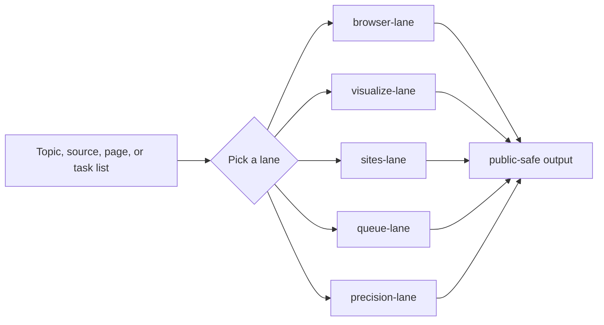

<p align="center">
  
</p>

<h1 align="center">AI Knowledge Workbench</h1>

<p align="center">
  <b>五功能知识工作台：先路由，再执行，再公开</b>
</p>

<p align="center">
  
  
  
  
</p>

## What It Does

This repository turns common knowledge work into a route-first Codex skill, a public GitHub repo, and a static demo page.

It helps with:

- reading sources before writing
- making diagrams, charts, or visual briefs
- building or polishing README and GitHub Pages surfaces
- ordering multi-step tasks
- asking the smallest useful clarifying question

## Five Lanes

| Lane | Use it for | Typical output |
|---|---|---|
| `browser-lane` | source reading, screenshots, papers, current facts | source map, fact/inference split, safe summary |
| `visualize-lane` | charts, diagrams, flows, comparisons | visual brief, layout, labels, export target |
| `sites-lane` | README, static site, GitHub Pages, demo page | page map, content blocks, publish checklist |
| `queue-lane` | multiple tasks, dependencies, priorities | ordered queue, status notes, handoff plan |
| `precision-lane` | ambiguity, privacy risk, unsupported claims | minimum question, safe assumption, caveats |



## How To Use

```text
Use $ai-knowledge-writing-skill to read [source] and separate facts, inference, and what still needs verification.
```

```text
Use $ai-knowledge-writing-skill to turn [topic] into a visual brief, a page brief, or an ordered task queue.
```

```text
Use $ai-knowledge-writing-skill to review [draft] for privacy leakage and unsupported claims before publishing.
```

## Demo Page

**[Live demo](https://sushuqiong.github.io/ai-knowledge-writing-skill/)**  
The page shows what each lane is for, what it outputs, what not to do, and which details must stay private.

## Privacy Rules

Public examples use placeholders only. Do not publish local file paths, account names, emails, tokens, private URLs, hidden screenshots, or machine-specific traces.

When in doubt, generalize the detail and keep it out of public text.

## Repository Structure

| Path | Purpose |
|---|---|
| `SKILL.md` | main Codex skill entry |
| `agents/openai.yaml` | skill UI metadata |
| `references/*.md` | lane guidance, templates, and privacy notes |
| `docs/index.html` | static GitHub Pages demo |
| `assets/repo-cover.svg` | repository cover image |

## Release

Current public release: **[v0.2.0](https://github.com/sushuqiong/ai-knowledge-writing-skill/releases/tag/v0.2.0)**

## Topics

`ai-learning` `browser-workbench` `codex` `github-pages` `knowledge-workflow` `privacy-review` `prompt-routing` `route-first` `site-builder` `skill` `technical-writing` `visualization` `wechat-writing`

