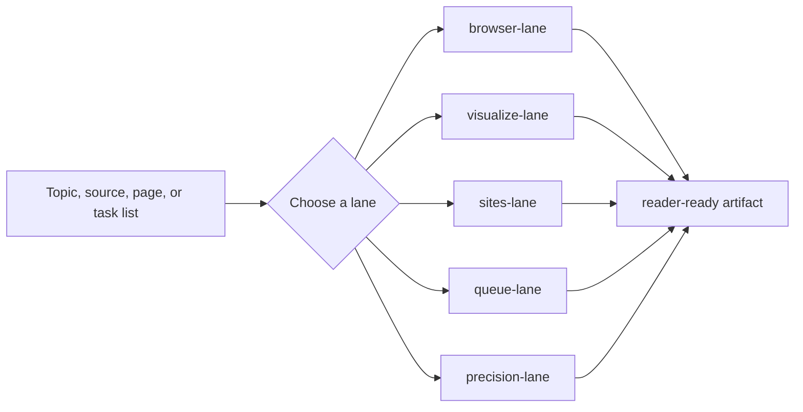

<p align="center">
  
</p>

<h1 align="center">AI Knowledge Workbench</h1>

<p align="center">
  <b>五功能知识工作台：browser / visualize / sites / queue / precision</b>
</p>

<p align="center">
  
  
  
  
</p>

## What This Is

This repository turns a repeatable knowledge workflow into a route-first Codex skill, a public GitHub repo, and a static demo page.

It is built for tasks that need to:

- read or verify sources before writing
- turn ideas into diagrams or visual summaries
- publish a clean static site or README surface
- split work into an ordered queue
- ask only the minimum clarifying questions

## Five Lanes

| Lane | What it does | Typical output |
|---|---|---|
| `browser-lane` | read a source and verify public facts | source map, fact / inference split, safe summary |
| `visualize-lane` | turn ideas into charts or diagrams | visual brief, layout, labels, export target |
| `sites-lane` | build or improve public site surfaces | page map, content blocks, publish checklist |
| `queue-lane` | split and prioritize work | task queue, dependency order, insertion notes |
| `precision-lane` | remove ambiguity and risk | minimal questions, safe assumptions, caveats |



## Demo Page

Open the static demo page on GitHub Pages:

**[Live demo](https://sushuqiong.github.io/ai-knowledge-writing-skill/)**

It shows:

- one card per lane
- example prompts you can copy
- privacy reminders
- quick links to the repo and release

## Quick Start

Use this skill in Codex:

```text
Use $ai-knowledge-writing-skill to route [task] into the right lane and keep the output privacy-safe.
```

```text
Use $ai-knowledge-writing-skill to read [source] and turn it into a beginner-friendly public explainer.
```

```text
Use $ai-knowledge-writing-skill to build a static demo page for [topic] and keep it publishable.
```

## Repository Structure

| Path | Purpose |
|---|---|
| `SKILL.md` | main Codex skill entry |
| `agents/openai.yaml` | skill UI metadata |
| `references/*.md` | route guides, lane rules, templates, privacy notes |
| `docs/index.html` | static demo page for GitHub Pages |
| `assets/repo-cover.svg` | repository cover image |

## Privacy Rules

Public examples use placeholders only. Do not publish local file paths, account names, emails, tokens, private URLs, hidden screenshots, or machine-specific traces.

When in doubt, treat the detail as private and rewrite it into a generic placeholder.

## Release

First public trial release: **[v0.2.0](https://github.com/sushuqiong/ai-knowledge-writing-skill/releases/tag/v0.2.0)**  
Earlier trial release: **[v0.1.0](https://github.com/sushuqiong/ai-knowledge-writing-skill/releases/tag/v0.1.0)**

## Topics

`ai-learning` `codex` `github-pages` `knowledge-workflow` `privacy-review` `prompt-routing` `public-writing` `route-first` `skill` `technical-writing` `wechat-writing`

